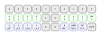
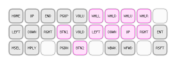
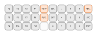
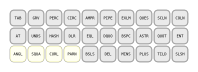
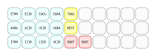

# Notes
- Left has magicboot on `Q`
- Right has magicboot on '.'

# TODO
- "handedness"
- uppercase French
- swap 0 and . ?
- move magicboot to home keys
- set up accelerators on RHS of accent layer
  - previous/next tab in browser
  - navigate back
  - ctrl-alt-delete
- have OS switching keys if auto-detection's unreliable

# Keyboard Layers

## Layer 0

## Layer 1

## Layer 2

## Layer 3

## Layer 4

